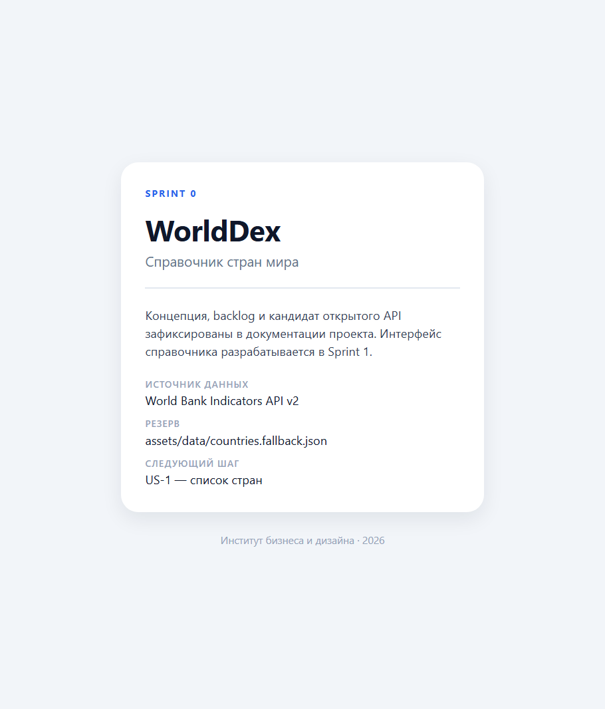

<div align="center">

**ИНСТИТУТ БИЗНЕСА И ДИЗАЙНА**

ОТЧЁТ О ПРАКТИЧЕСКОЙ РАБОТЕ / № 00

# Концепция продукта и подготовка проекта

Разработка мобильных приложений · БИнф-24

</div>

| | | | |
| --- | --- | --- | --- |
| **АВТОР** | Телков Владимир | **ПРЕПОДАВАТЕЛЬ** | Саенко Я.Д. |
| **ДАТА** | 09.09.2026 | **ГОРОД** | Москва |

---

## 01 / ПАСПОРТ ОТЧЁТА

### Паспорт отчёта

| Поле | Значение |
| --- | --- |
| Дисциплина | Разработка мобильных приложений |
| Практическая работа | № 00 — Концепция продукта и подготовка проекта |
| Студент | Телков Владимир Сергеевич |
| Группа | БИнф-24 |
| Преподаватель | Саенко Я.Д. |
| Дата | 09.09.2026 |
| Связанный спринт | Sprint 0 — концепция мобильного справочника (занятие 02.09.2026) |
| Ссылка на реквест с изменениями | https://github.com/Leladatan/study-mobile-project/pull/1 |
| Тег | `sprint-0` |

### Цель работы

Подготовить основу мобильного справочника, на которой будут делаться следующие практические работы.

### Задачи

- выбрать тему и название справочника;
- описать проблему, идею, аудиторию и основной сценарий;
- определить, что входит в первую версию;
- найти открытый API, проверить его и подготовить резервные данные;
- составить backlog;
- создать проект Expo и репозиторий;
- опубликовать работу через pull request и поставить тег.

---

## 02 / ВЫПОЛНЕНИЕ

### Что сделано

| Файл | Содержание |
| --- | --- |
| `README.md` | описание проекта, аудитория, сценарий, запуск |
| `docs/product-concept.md` | проблема, идея, аудитория, сценарий, границы MVP, API, риски |
| `docs/backlog.md` | 9 пользовательских историй, для US-1 — 6 критериев приёмки |
| `docs/environment.md` | версии инструментов и результаты проверок |
| `docs/git-workflow.md` | порядок публикации спринта |
| `assets/data/countries.fallback.json` | резервные данные: 12 стран |
| `App.tsx` | экран-заглушка |
| `.gitignore` | добавлены `.env` и `.env.*`, чтобы не закоммитить ключи |

### Тема и идея

Тема — страны мира, название — WorldDex.

Проблема: факты об одной стране разбросаны по разным сайтам, у источников разные годы, поэтому
страны трудно сравнивать, а без интернета ничего не найти.

Идея: одна карточка на страну, все данные из World Bank за один период, резервный набор для
работы без сети.

Аудитория — студенты 1–2 курса и старшеклассники, которые готовят доклады. Основной сценарий:
открыть приложение, найти Японию через поиск, открыть карточку, прочитать факты и вернуться
к списку.

### Проект

Проект создан из шаблона без лишних библиотек:

```bash
npx create-expo-app@latest worlddex --template blank-typescript
```

В шаблоне нет навигации и глобального состояния, что подходит под ограничения спринта.
`App.tsx` показывает заглушку с названием, источником данных и следующим шагом. Она нужна только
для того, чтобы проверить, что проект собирается и запускается.

### Выбор API

Сначала рассматривался REST Countries v3.1, но запрос показал, что версия устарела:

```
GET https://restcountries.com/v3.1/name/japan
HTTP 200
{ "success": false, "data": null,
  "errors": [{ "message": "This API version has been deprecated..." }] }
```

Новая версия v5 требует регистрацию и ключ. Поэтому выбран World Bank Indicators API v2: он
бесплатный, работает без ключа, данные официальные, лицензия CC BY-4.0. Флаги в нём не отдаются,
их берём с flagcdn.com.

Резервные данные в `assets/data/countries.fallback.json` собраны из настоящих ответов API,
а не написаны вручную. Поэтому формат у них такой же, как у основного источника.

### Проверка

| Проверка | Команда или запрос | Результат |
| --- | --- | --- |
| Типы | `npm run typecheck` | без ошибок |
| Конфигурация | `npm run doctor` | 21/21 |
| Список стран | `GET /v2/country?format=json&per_page=300` | 200, 295 записей, из них 217 стран |
| Одна страна | `GET /v2/country/RUS?format=json` | 200, столица Moscow |
| Страны региона | `GET /v2/country?format=json&region=ECS` | 200, 58 стран |
| Население | `GET /v2/country/RUS/indicator/SP.POP.TOTL?format=json&mrv=1` | 200, 143 513 328 за 2025 год |
| Неверный код | `GET /v2/country/ZZZ?format=json` | 200, ошибка в теле ответа |
| Флаг | `GET https://flagcdn.com/w320/ru.png` | 200, картинка PNG |



**Рисунок 1** — Экран-заглушка WorldDex, запуск в браузере

---

## 03 / РЕЗУЛЬТАТЫ

### Результат

Готов репозиторий с концепцией, backlog, проверенным API и проектом, который собирается без
ошибок. Приложение пока показывает заглушку, интерфейс делается в следующих спринтах.

**Таблица 1 — Критерии приёмки**

| Критерий | Где выполнен | Статус |
| --- | --- | --- |
| Зафиксированы тематика и название | README, концепция | выполнено |
| Сформулированы идея и проблема | концепция: «Проблема», «Идея» | выполнено |
| Определены аудитория и основной сценарий | концепция: «Аудитория», «Основной сценарий» | выполнено |
| Указаны документация API, доступ, данные, ограничения и резерв | концепция: «Источник данных» | выполнено |
| В backlog не меньше пяти историй | `docs/backlog.md`, 9 историй | выполнено |
| У первой истории не меньше трёх критериев | US-1, 6 критериев | выполнено |
| README и концепция описывают продукт одинаково | одна проблема, аудитория и сценарий | выполнено |
| Репозиторий доступен, среда готова | публичный репозиторий, проверки проходят | выполнено |

**Таблица 2 — Ограничения**

| Ограничение | Статус |
| --- | --- |
| Не делать полноценный интерфейс | соблюдено, в приложении только заглушка |
| Не подключать API и не делать сетевые запросы | соблюдено, API проверялся запросами вне приложения |
| Не добавлять Redux, базу данных и навигацию | соблюдено |
| Не хранить ключи и секреты в репозитории | соблюдено, API без ключа, `.env` в `.gitignore` |
| Тема с реальным сценарием и доступными данными | соблюдено |

**Таблица 3 — Definition of Done**

| Пункт | Статус |
| --- | --- |
| Репозиторий создан и доступен преподавателю | выполнено |
| В README есть название, описание, тема, аудитория и сценарий | выполнено |
| В концепции есть проблема, MVP и API | выполнено |
| В backlog не меньше пяти историй | выполнено, 9 историй |
| У первой истории не меньше трёх критериев | выполнено, 6 критериев |
| Есть pull request и тег `sprint-0` | выполнено, PR #1 |
| Идею и границы первой версии можно объяснить за минуту | выполнено |

### Проблемы и решения

**1. Устаревший API.** REST Countries v3.1 отвечает кодом 200, но вместо данных присылает ошибку.
По статусу этого не видно, только по телу ответа. Решение — World Bank API.

**2. Группы стран в списке.** API возвращает не только страны, но и группы вроде «High income».
Их отсекаем по `region.id === "NA"`, остаётся 217 стран. Это условие записано в критерии US-1.

**3. Ошибки с кодом 200.** Запрос `/v2/country/ZZZ` отвечает 200, поэтому проверки `response.ok`
недостаточно — нужно смотреть, что пришло в теле. Это тоже записано в критерии US-1.

**4. Нет флагов и русских названий.** Флаги берутся с flagcdn.com. Поиск по-русски вынесен
в backlog отдельной историей US-8.

### Ретроспектива

- **Получилось:** API проверен запросами до того, как начат код; резервные данные собраны
  из настоящих ответов.
- **Мешало:** первый выбранный API оказался нерабочим.
- **Долг:** в резервном наборе только 12 стран.
- **Дальше:** первый экран справочника.

---

## 04 / ЗАВЕРШЕНИЕ

### Выводы

Основа проекта готова: есть концепция, backlog, проверенный источник данных и проект, который
собирается без ошибок. Работа опубликована через pull request #1 и отмечена тегом `sprint-0`.
Главный вывод спринта — внешний сервис нужно проверять настоящими запросами, а не только
по документации: так выяснилось, что популярный REST Countries уже не работает.

---

## 05 / КОНТРОЛЬНЫЕ ВОПРОСЫ

### Контрольный вопрос 1

**Какую проблему решает выбранное приложение?**

Факты о стране разбросаны по разным сайтам: столица в одном месте, население в другом. У источников
разные годы, поэтому страны трудно сравнивать, и без интернета ничего не найти. WorldDex собирает
все факты из одного источника в одну карточку и может работать без сети.

### Контрольный вопрос 2

**Кто является его основным пользователем?**

Студенты 1–2 курса и старшеклассники, которые готовят доклады по географии и экономике. Они ищут
информацию с телефона, им нужен быстрый ответ и ссылка на источник. Дополнительно — участники
викторин по географии. Аналитикам с временными рядами приложение не подходит.

### Контрольный вопрос 3

**Какой пользовательский сценарий будет реализован первым?**

По первоначальному плану — список стран, история US-1: открыть приложение и сразу увидеть все
страны. Без списка не работают ни поиск, ни карточка. После выхода методичек № 01 и № 02 порядок
изменился: сначала витрина на локальных данных, а загрузка из API — в Sprint 3.

### Контрольный вопрос 4

**Какие функции входят в MVP?**

Список стран, поиск по названию, фильтр по региону, карточка страны с флагом и основными фактами,
состояния загрузки и ошибки, работа без сети на резервных данных.

### Контрольный вопрос 5

**От каких функций можно отказаться в первой версии?**

От авторизации, карты, графиков по годам, сравнения стран, русских названий и push-уведомлений.
Без них основной сценарий «быстро найти факт о стране» всё равно работает.

### Контрольный вопрос 6

**Почему выбранный API подходит для справочника и какой источник станет резервным?**

World Bank API бесплатный, работает без ключа, данные официальные и у всех стран одинаковые
поля за один период. Все нужные данные проверены запросами. Резервный источник — файл
`assets/data/countries.fallback.json` с 12 странами, собранный из настоящих ответов API.

### Контрольный вопрос 7

**Как Sprint 1 приблизит продукт к работающей версии?**

Появится первый настоящий экран: карточки стран вместо заглушки. Карточка будет отдельным
компонентом с типизированными props, поэтому потом её можно будет использовать и с данными из API.

### Источники

1. World Bank. About the Indicators API Documentation.
   https://datahelpdesk.worldbank.org/knowledgebase/articles/889392-about-the-indicators-api-documentation
2. World Bank. API Basic Call Structures.
   https://datahelpdesk.worldbank.org/knowledgebase/articles/898581-api-basic-call-structures
3. World Bank. Open Data Terms of Use (CC BY-4.0). https://datacatalog.worldbank.org/public-licenses
4. Expo. Create a project. https://docs.expo.dev/get-started/create-a-project/
5. React Native. Getting Started. https://reactnative.dev/docs/getting-started
6. REST Countries. Legacy API deprecation. https://restcountries.com/docs/countries/legacy-api-deprecation
7. Flagpedia. flagcdn.com. https://flagcdn.com/

Дата обращения ко всем источникам: 09.09.2026.

---

<div align="center">

Институт бизнеса и дизайна · obe.ru · Москва · 2026

</div>
