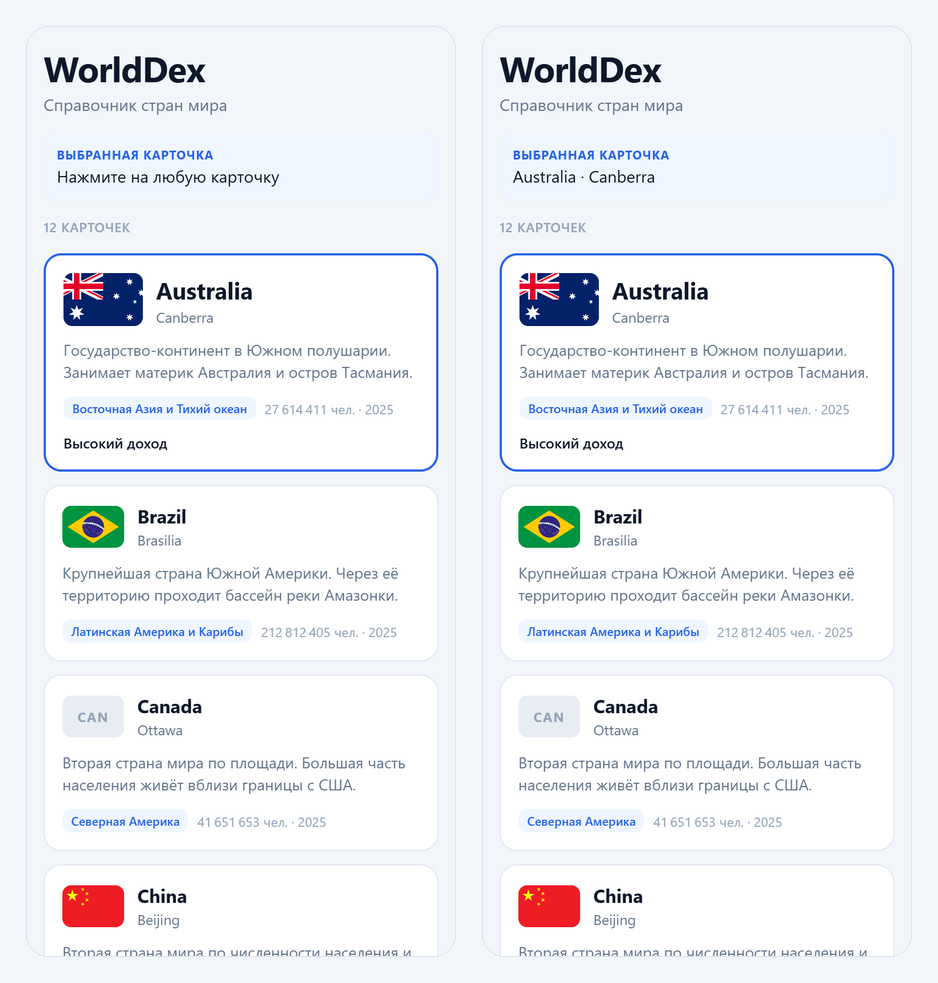

<div align="center">

**ИНСТИТУТ БИЗНЕСА И ДИЗАЙНА**

ОТЧЁТ О ПРАКТИЧЕСКОЙ РАБОТЕ / № 01

# Базовый UI: компоненты, props и TypeScript

Разработка мобильных приложений · БИнф-24

</div>

| | | | |
| --- | --- | --- | --- |
| **АВТОР** | Телков Владимир | **ПРЕПОДАВАТЕЛЬ** | Саенко Я.Д. |
| **ДАТА** | 16.09.2026 | **ГОРОД** | Москва |

---

## 01 / ПАСПОРТ ОТЧЁТА

### Паспорт отчёта

| Поле | Значение |
| --- | --- |
| Дисциплина | Разработка мобильных приложений |
| Практическая работа | № 01 — Базовый UI: компоненты, props и TypeScript |
| Студент | Телков Владимир Сергеевич |
| Группа | БИнф-24 |
| Преподаватель | Саенко Я.Д. |
| Дата | 16.09.2026 |
| Связанный спринт | Sprint 1 — статическая витрина справочника |
| Предыдущая версия продукта | Sprint 0: концепция продукта, backlog и подготовленная среда (тег `sprint-0`) |
| Ссылка на реквест с изменениями | https://github.com/Leladatan/study-mobile-project/pull/2 |
| Тег спринта | `sprint-1` |

### Цель практической работы

Создать первый экран справочника из переиспользуемых типизированных компонентов.

**Продуктовый инкремент:** статическая витрина справочника из 12 карточек стран, построенная
на одном переиспользуемом компоненте `TopicCard` и локальных fixtures.

### Задачи практической работы

**Планирование.** Сверить backlog Sprint 0 с методическими указаниями к работам № 01 и № 02
и перепланировать истории так, чтобы Sprint 1 и Sprint 2 работали на локальных данных.

**Разработка.** Описать тип основной сущности `Topic` и расширить его полями предметной области,
вынести данные в отдельный файл fixtures, реализовать переиспользуемый компонент `TopicCard`
с типизированными props и собрать экран каталога из базовых компонентов React Native.

**Проверка.** Выполнить проверку типов и конфигурации, убедиться, что нажатие вызывает
типизированный callback, а отсутствие изображения не ломает вёрстку, проверить Fast Refresh
и определить, какой движок JavaScript использует проект.

**Review и выпуск.** Опубликовать инкремент в ветке `feature/sprint-1-basic-ui`, создать pull
request «Sprint 1: базовый UI справочника», влить его в `main`, поставить тег `sprint-1`,
обновить README, backlog и CHANGELOG, приложить скриншот.

**Retrospective.** Зафиксировать результат, затруднения, технический долг и следующий шаг.

---

## 02 / ВЫПОЛНЕНИЕ

### Выполнение работы

#### Реализованные изменения

Экран-заглушка Sprint 0 заменён первым пользовательским экраном — каталогом стран. Сетевые
запросы, навигация и глобальное состояние по-прежнему не используются: все данные локальные.

| Артефакт | Содержание |
| --- | --- |
| `src/types/topic.ts` | Тип `Topic`, объединения `RegionId` и `IncomeLevel`, справочники `REGION_NAMES` и `INCOME_NAMES` |
| `src/data/topics.ts` | Локальные fixtures: 12 стран, `id` — код страны ISO-3 |
| `src/components/TopicCard.tsx` | Переиспользуемая карточка и её контракт `TopicCardProps` |
| `src/screens/CatalogScreen.tsx` | Экран каталога: вывод fixtures и строка «Выбранная карточка» |
| `src/lib/format.ts` | `formatPopulation` — число с разделителями разрядов |
| `src/theme.ts` | Общие цвета, отступы и радиусы |
| `App.tsx` | Подключает `CatalogScreen` вместо экрана-заглушки |
| `assets/sprint-1.png` | Демонстрационный артефакт спринта |
| `README.md` | Статус, скриншот, структура проекта, раздел «Как устроена витрина» |
| `docs/backlog.md` | Перепланирование спринтов, новые истории US-10 и US-11 |
| `docs/environment.md` | Раздел 6 — Metro, Hermes и проверка Fast Refresh |
| `CHANGELOG.md` | Запись `[sprint-1]` |

#### Модель данных

Основная сущность описана типом `Topic`. Обязательные поля задания — `id` и `title`,
содержательное поле — `description`, необязательное — `imageUrl`. Остальные поля относятся
к предметной области справочника стран:

```ts
export type Topic = {
  id: string;
  title: string;
  description: string;
  imageUrl?: string;
  capital: string;
  regionId: RegionId;
  regionName: string;
  incomeLevel: IncomeLevel;
  population: number;
  populationYear: string;
  iso2: string;
};
```

#### Контракт компонента

```ts
export type TopicCardProps = {
  topic: Topic;
  onPress: (topic: Topic) => void;
  featured?: boolean;
};
```

`topic` — данные карточки, `onPress` — callback нажатия, `featured` — необязательный prop.
`children` в контракте нет: вкладывать в карточку нечего, а задание допускает `children` только
при реальной необходимости.

#### Ключевые технические решения

**1. Предметные поля — строгие типы, а не `string`.** `RegionId` и `IncomeLevel` описаны
объединениями строковых литералов. Опечатка в fixtures вроде `regionId: 'ECZ'` становится
ошибкой компиляции, а справочник `REGION_NAMES: Record<RegionId, string>` не соберётся, если
для какого-то региона забыть название.

**2. Стабильный `id` — код страны ISO-3.** `AUS`, `BRA`, `CAN` и так далее: значение уникально,
не зависит от порядка элементов в массиве и совпадает с идентификатором страны в World Bank API.
Когда данные начнут приходить из сети, идентификаторы не придётся менять.

**3. Карточка не знает, откуда пришли данные.** `TopicCard` импортирует только компоненты
React Native, тип `Topic`, тему оформления и функцию форматирования. Массив `TOPICS` в неё не
импортируется: объект приходит через props, а о нажатии компонент сообщает наружу, вызывая
`onPress(topic)`. Что делать с нажатием, решает экран.

**4. Необязательный prop со значением по умолчанию.** `featured` деструктурируется как
`featured = false`, поэтому вызывать карточку без него безопасно. Им выделена первая карточка
каталога: рамка акцентного цвета, увеличенные флаг и заголовок, строка с уровнем дохода.

**5. Отсутствие изображения обрабатывается предсказуемо.** В компоненте условный рендер:
если `imageUrl` задан — `Image`, иначе — блок того же размера с кодом страны. У объекта `CAN`
поле `imageUrl` отсутствует намеренно, чтобы ветка с заглушкой проверялась на реальных данных,
а не оставалась гипотетической. Кроме того, у `Image` задан фоновый цвет: пока удалённый флаг
загружается, на его месте нейтральный прямоугольник, а не пустота.

**6. Вывод перебором без копирования разметки.** Экран вызывает `TOPICS.map(...)` и для каждого
объекта рендерит `TopicCard` с `key={topic.id}`. Контейнером служит `ScrollView`: 12 карточек
не помещаются на экран, а `FlatList` по методическим указаниям вводится в Sprint 2.

**7. Callback меняет видимое состояние, но не навигацию.** Экран хранит последнюю нажатую
карточку в `useState<Topic | null>`. Обработчик `handlePress(topic)` сохраняет объект, и строка
«Выбранная карточка» показывает название и столицу. Переход на другой экран не выполняется —
навигация в этом спринте запрещена.

**8. Запуск в браузере для артефакта.** Добавлены `react-dom`, `react-native-web`
и `@expo/metro-runtime`. Это не библиотека готовых карточек, а официальная веб-поддержка Expo:
она нужна, чтобы снять демонстрационный скриншот и быстро проверять вёрстку.

#### Проверка результата

| Проверка | Способ | Результат |
| --- | --- | --- |
| Проверка типов | `npm run typecheck` (`tsc --noEmit`) | Без ошибок |
| Конфигурация проекта | `npx expo-doctor` | 21/21 проверок пройдено |
| Отсутствие `any` | Поиск по `src/` и `App.tsx` | 0 вхождений |
| Чистая установка | `npm ci` в новом клоне репозитория, затем `tsc --noEmit` на теге `sprint-1` | Установлено 488 пакетов, `tsc --noEmit` без ошибок |
| Сборка под Android | `npx expo export --platform android` на теге `sprint-1` | Бандл собран: байт-код Hermes (`.hbc`), 1,4 МБ |
| Отрисовка каталога | Запуск в браузере через Metro | 12 карточек, все флаги загружены |
| Callback нажатия | Нажатие на карточку Australia | Строка выбора: «Australia · Canberra» |
| Необязательное изображение | Карточка Canada | Заглушка `CAN`, компоновка не нарушена |
| Fast Refresh | Изменение `title` в `src/data/topics.ts` при запущенном Metro | Экран обновился без перезагрузки |
| Движок JavaScript | Манифест, который Metro отдаёт клиенту Android | `transform.engine=hermes`, `transform.bytecode=1` |

#### Порядок приёмки

| Шаг приёмки | Как показать |
| --- | --- |
| Чистая установка зависимостей | `npm install`, затем `npm start` по разделу «Запуск» в README |
| Запуск и не менее трёх карточек | Expo Go или `npm run web` — на экране 12 карточек |
| Fast Refresh | Изменить `title` у любой страны в `src/data/topics.ts` и сохранить файл |
| Ошибка TypeScript | Удалить `onPress={handlePress}` в `src/screens/CatalogScreen.tsx` — `npm run typecheck` сообщит об отсутствии обязательного prop |
| Независимость `TopicCard` | Открыть импорты `src/components/TopicCard.tsx` — fixtures среди них нет |
| Путь события | `Pressable` → `onPress(topic)` → `handlePress` → `setSelected` → перерисовка строки выбора |
| Pull request, CHANGELOG, тег, артефакт | PR #2, запись `[sprint-1]`, тег `sprint-1`, `assets/sprint-1.png` |

---



**Рисунок 1** — Витрина WorldDex: слева каталог при запуске, справа — после нажатия на карточку
Australia. У карточки Canada вместо флага заглушка `CAN`

---

## 03 / РЕЗУЛЬТАТЫ

### Результаты работы

Получен продуктовый инкремент Sprint 1: первый пользовательский экран справочника. После запуска
приложение показывает 12 карточек стран с флагом, столицей, описанием, регионом и населением.
Все карточки отрисованы одним компонентом `TopicCard`, данные лежат в отдельном файле fixtures
и проверяются компилятором на соответствие типу `Topic`.

Нажатие на карточку вызывает типизированный callback с объектом `Topic`, и экран показывает,
какая карточка выбрана. Карточка без изображения отображается с заглушкой и не ломает вёрстку.

**Таблица 1 — Выполнение критериев приёмки**

| Критерий приёмки | Результат проверки | Статус |
| --- | --- | --- |
| Проект запускается после чистой установки зависимостей по инструкции из README | В README раздел «Запуск»: `npm install`, `npm start`. Чистая установка проверена в новом клоне репозитория | ВЫПОЛНЕНО |
| Все fixtures соответствуют типу Topic и имеют стабильные уникальные id | Массив объявлен как `TOPICS: Topic[]`, компилятор проверяет каждый объект; 12 идентификаторов ISO-3 без повторов | ВЫПОЛНЕНО |
| TopicCard используется не менее трёх раз и не содержит собственных данных каталога | Карточка отрисовывается 12 раз перебором `TOPICS`; импорта fixtures в компоненте нет | ВЫПОЛНЕНО |
| Обязательные и необязательные props, а также callback типизированы без необоснованного any | `TopicCardProps`: `topic`, `onPress: (topic: Topic) => void`, `featured?: boolean`; `any` в коде нет | ВЫПОЛНЕНО |
| Необязательное изображение обрабатывается предсказуемо | Условный рендер: `Image` или заглушка с кодом страны; проверено на карточке Canada | ВЫПОЛНЕНО |
| Нажатие на карточку вызывает callback с id или объектом Topic | `onPress(topic)` передаёт объект целиком; экран показывает название и столицу | ВЫПОЛНЕНО |
| Fast Refresh проверен, студент различает задачи Metro и Hermes | Проверка правкой fixtures; разбор задач в `docs/environment.md`, раздел 6, и в контрольных вопросах 6–7 | ВЫПОЛНЕНО |
| Функции Sprint 0 сохранены: концепция, backlog и история репозитория не потеряны | `docs/` с концепцией и backlog на месте, тег `sprint-0` и история коммитов не изменены | ВЫПОЛНЕНО |

**Таблица 2 — Соблюдение ограничений**

| Ограничение | Статус |
| --- | --- |
| Не использовать `any` без письменного технического обоснования | Соблюдено — ни одного вхождения |
| Не хранить fixtures внутри `TopicCard` и не связывать компонент с источником данных | Соблюдено — данные в `src/data/topics.ts` |
| Не копировать разметку карточки для каждого объекта | Соблюдено — один компонент, вывод перебором |
| Не подключать API, Redux, базу данных и навигацию | Соблюдено |
| Не заменять собственный компонент библиотекой готовых UI-карточек | Соблюдено — таких библиотек в зависимостях нет |

**Таблица 3 — Definition of Done спринта**

| Пункт | Статус |
| --- | --- |
| Пользовательский сценарий Sprint 1 работает на целевой платформе | Проверено в веб-сборке и сборкой Android-бандла; запуск на устройстве через Expo Go демонстрируется на защите |
| TypeScript-проверка и настроенные проверки качества проходят без ошибок | ВЫПОЛНЕНО — `tsc --noEmit`, `expo-doctor` 21/21 |
| README содержит команды запуска и краткое описание структуры проекта | ВЫПОЛНЕНО — разделы «Запуск» и «Структура проекта» |
| Изменения прошли через pull request и объединены в основную ветку | ВЫПОЛНЕНО — PR #2 влит в `main` |
| CHANGELOG содержит запись о статической витрине справочника | ВЫПОЛНЕНО — запись `[sprint-1]` |
| Создан тег `sprint-1` и приложен скриншот либо короткое видео | ВЫПОЛНЕНО — тег на коммите `88d9e63`, `assets/sprint-1.png` |
| Студент может объяснить компонент, контракт props, callback, Metro и Hermes | ВЫПОЛНЕНО — раздел 05 |

**Таблица 4 — Публикация**

| Поле | Значение |
| --- | --- |
| Ветка | `feature/sprint-1-basic-ui` |
| Pull request | #2 «Sprint 1: базовый UI справочника», влит 09.09.2026 |
| Тег | `sprint-1` → коммит `88d9e63` |
| CHANGELOG | Статическая витрина и переиспользуемая `TopicCard` |
| Артефакт | `assets/sprint-1.png` |

### Анализ результата

Цель работы — создать первый экран справочника из переиспользуемых типизированных
компонентов — достигнута. Все восемь критериев приёмки закрыты, все пять ограничений соблюдены.

Главная ценность спринта — контракт `TopicCard`. Компонент не хранит состояние каталога и не
знает об источнике данных, поэтому его устойчивость проверяется просто: в Sprint 2 карточка
перешла из ручного перебора в `FlatList` и получила выбор, но для этого в контракт понадобилось
добавить только один необязательный prop `selected`. Существующие вызовы не изменились.

Типизация закрыта с запасом по сравнению с минимумом задания. Задание требует типизировать
props и callback; дополнительно предметные поля `regionId` и `incomeLevel` описаны
объединениями литералов, поэтому ошибки в fixtures ловятся компилятором, а не проявляются
пустой подписью на экране.

Критерий про необязательное изображение закрыт на реальных данных, а не на бумаге: у одной
страны `imageUrl` отсутствует в fixtures, и ветка с заглушкой видна на экране при каждом запуске.

### Возникшие проблемы и решения

**Проблема 1. Backlog противоречил методическим указаниям.**

В backlog Sprint 0 история US-1 «Список стран» стояла на Sprint 1 и в первом же критерии
приёмки требовала запрос к World Bank API. Методические указания к работам № 01 и № 02
запрещают подключать API в обоих спринтах.

**Решение:** backlog перепланирован. Sprint 1 и Sprint 2 работают на локальных данных,
история US-1 перенесена в Sprint 3, под фактическое содержание спринтов заведены истории US-10
«Витрина справочника на локальных данных» и US-11 «Выбор карточек и счётчик». Причина
перепланирования записана в самом backlog, состав старых историй и их критерии не изменены.

**Проблема 2. Карточки не помещаются на экран, а FlatList вводится позже.**

Двенадцать карточек не помещаются на экран телефона, а `FlatList` по методическим указаниям
относится к Sprint 2.

**Решение:** контейнером стал `ScrollView`, карточки выводятся перебором `TOPICS.map`. Для
двенадцати элементов это приемлемо; ограничение подхода — все карточки монтируются сразу —
записано в технический долг и закрыто в Sprint 2 переходом на `FlatList`.

**Проблема 3. Удалённые изображения загружаются асинхронно.**

Флаги загружаются с `flagcdn.com` после отрисовки экрана. На первом снимке экрана вместо флагов
оказались пустые прямоугольники: изображения ещё не успели прийти.

**Решение:** у `Image` задан фоновый цвет, поэтому до загрузки на месте флага виден нейтральный
блок нужного размера, и вёрстка не прыгает. Случай, когда `imageUrl` отсутствует совсем,
обрабатывается отдельно — заглушкой с кодом страны. Для скриншота добавлено ожидание загрузки
всех изображений.

**Проблема 4. Тег поставлен до слияния pull request.**

Команды публикации были выполнены одним блоком: `git checkout main`, `git pull`, `git tag`,
`git push`. Pull request к этому моменту ещё не был создан, поэтому локальная ветка `main`
указывала на коммит Sprint 0, и тег `sprint-1` ушёл на GitHub с неправильной ссылкой.

**Решение:** тег удалён локально и на GitHub (`git tag -d sprint-1`,
`git push origin --delete sprint-1`), pull request создан и влит, после `git pull` тег поставлен
заново — на коммит слияния `88d9e63`. Вывод для следующих спринтов: тег ставится только после
слияния и обновления локальной ветки.

**Проблема 5. Git не может удалить каталоги при переключении веток.**

При переходе на `main` git сообщил `Deletion of directory 'src/components' failed`. Каталог
проекта находится в папке, синхронизируемой OneDrive, а он удерживает дескрипторы файлов.

**Решение:** повторная попытка отменена — данные не пострадали, коммит ветки уже был на GitHub,
а пустые каталоги git не отслеживает. На время операций с ветками синхронизация OneDrive
приостанавливается.

### Ретроспектива

**Что получилось.** Контракт `TopicCard` оказался достаточным для следующего спринта почти без
изменений. Строгие типы предметных полей превратили часть возможных ошибок данных в ошибки
компиляции. Заглушка для изображения проверяется на реальном объекте, а не в теории.

**Что мешало.** Расхождение backlog с методическими указаниями обнаружилось только в начале
спринта. Публикация прошла со сбоями: тег был поставлен раньше слияния, а OneDrive мешал
переключению веток.

**Технический долг.** Данные хранятся в коде проекта; при переходе на API их структуру придётся
согласовать с ответом World Bank. `ScrollView` монтирует все карточки сразу — для 217 стран это
не подойдёт. Линтер в проекте не настроен.

**Возвращено в backlog.** US-1 «Список стран из World Bank API» и US-7 «Численность населения
из API» — в Sprint 3; US-3 «Карточка страны» и US-5 «Работа без сети» — в Sprint 4, поскольку
первая требует навигации, а вторая имеет смысл только после появления сетевого источника.

**Что изменить в Sprint 2.** Заменить ручной перебор на `FlatList`. Команды публикации
выполнять по шагам: слияние pull request на GitHub — между пушем ветки и постановкой тега.

---

## 04 / ЗАВЕРШЕНИЕ

### Выводы

**Основной результат.** Создан первый экран мобильного справочника WorldDex — статическая
витрина из 12 карточек стран. Экран собран из базовых компонентов React Native, все карточки
отрисованы одним переиспользуемым компонентом `TopicCard`, данные вынесены в отдельный файл
fixtures и описаны типом `Topic`.

**Соответствие цели и критериям приёмки.** Цель достигнута. Все восемь критериев приёмки
закрыты: проект устанавливается и запускается по README, fixtures соответствуют типу и имеют
стабильные идентификаторы, карточка переиспользуется и не знает об источнике данных, props
и callback типизированы без `any`, отсутствие изображения обрабатывается заглушкой, Fast Refresh
проверен, функции Sprint 0 сохранены. Ограничения соблюдены: API, Redux, базы данных, навигации
и готовых UI-библиотек в проекте нет.

**Закреплённые навыки и инженерные подходы.** Разделение экрана и компонента по
ответственности: экран владеет данными и состоянием, компонент отображает один объект
и сообщает о событиях. Проектирование контракта props так, чтобы компонент можно было
переиспользовать без правок. Использование TypeScript не только для props, но и для
предметной модели. Понимание того, что проверяет TypeScript, а что остаётся на время
выполнения, и разницы между сборкой кода в Metro и его исполнением в Hermes.

---

## 05 / КОНТРОЛЬНЫЕ ВОПРОСЫ

### Контрольный вопрос 1

**Чем компонент отличается от экрана приложения?**

**ОТВЕТ.** Компонент — переиспользуемый фрагмент интерфейса с узким контрактом. Он получает
данные через props, отображает их и сообщает о событиях наружу, но не знает, в каком контексте
его используют. Экран — компонент верхнего уровня, который соответствует задаче пользователя:
он владеет данными и состоянием и собирает интерфейс из компонентов.

В проекте `TopicCard` рисует одну страну и ничего не знает ни о других карточках, ни о том,
откуда взялся объект. `CatalogScreen` знает о массиве `TOPICS`, хранит выбранную карточку и
решает, что происходит при нажатии. Практический признак компонента — его можно перенести
в другое место без изменений: в Sprint 2 `TopicCard` без переделки перешёл в `FlatList`.

### Контрольный вопрос 2

**Зачем данные передаются в TopicCard через props?**

**ОТВЕТ.** Props — единственный вход компонента. Благодаря им карточка работает как функция от
данных: один и тот же объект `Topic` всегда даёт одну и ту же карточку. Отсюда три следствия.
Один компонент отрисовывает все 12 стран, получая каждый раз другой объект. Источник данных
можно сменить — с fixtures на ответ API — не трогая компонент. TypeScript проверяет каждый
вызов карточки на соответствие контракту.

Данные идут сверху вниз: экран передаёт карточке объект через props, а карточка сообщает
экрану о нажатии через callback `onPress`.

### Контрольный вопрос 3

**Почему fixtures не должны находиться внутри карточки?**

**ОТВЕТ.** Если положить данные внутрь карточки, компонент окажется привязан к одному набору
стран и перестанет быть переиспользуемым. Каждая карточка «знала» бы весь каталог, хотя
отображает одну запись. При переходе на API пришлось бы переписывать сам компонент, а не только
место получения данных. Смешались бы две ответственности: хранение данных и их отображение.

Поэтому fixtures лежат в `src/data/topics.ts`. В Sprint 1 их импортирует экран, а начиная
со Sprint 2 — пользовательский hook `useCatalog`. `TopicCard` их не импортирует.

### Контрольный вопрос 4

**Чем обязательный prop отличается от optional prop?**

**ОТВЕТ.** Обязательный prop должен быть передан при каждом использовании компонента, иначе
TypeScript сообщит об ошибке ещё до запуска: например, без `onPress` получится ошибка вида
«Property 'onPress' is missing». В `TopicCardProps` обязательны `topic` и `onPress` — без данных
и без реакции на нажатие карточка не имеет смысла.

Необязательный prop помечен знаком `?`, его тип расширяется до `boolean | undefined`.
Компонент обязан корректно работать, когда значение не передано, поэтому для `featured` задано
значение по умолчанию: `featured = false`. Вызов `<TopicCard topic={topic} onPress={handlePress} />`
корректен, а выделение первой карточки включается явным `featured`.

### Контрольный вопрос 5

**Что TypeScript проверяет до запуска приложения, а что он не проверяет?**

**ОТВЕТ.** До запуска TypeScript проверяет: переданы ли все обязательные props и совпадают ли
типы значений; соответствует ли сигнатура callback объявленной `(topic: Topic) => void`;
соответствует ли каждый объект fixtures типу `Topic`; допустимы ли значения `regionId`
и `incomeLevel`; заполнены ли справочники `Record<RegionId, string>` для всех ключей;
нет ли обращений к несуществующим полям.

Не проверяет TypeScript всё, что происходит во время выполнения. Важная деталь: при сборке
Metro удаляет типы из кода, не проверяя их, поэтому приложение с ошибкой типов всё равно
запустится — проверка выполняется отдельной командой `npm run typecheck`. TypeScript не знает,
открывается ли URL флага, актуальны ли данные о населении, совпадёт ли ответ сети с объявленным
типом, правильно ли написано условие фильтрации и корректна ли вёрстка.

### Контрольный вопрос 6

**Какую задачу выполняет Metro?**

**ОТВЕТ.** Metro — сборщик JavaScript для React Native, он работает на компьютере разработчика.
Начиная с точки входа `index.ts`, Metro находит все модули проекта, преобразует TypeScript и JSX
в JavaScript, объединяет их в бандл и отдаёт его клиенту — Expo Go на телефоне или браузеру.
Metro следит за файлами: при изменении он пересобирает затронутый модуль и отправляет
обновление в запущенное приложение. На этом построен Fast Refresh.

Ошибки Metro — ошибки сборки: не найден импортируемый модуль, синтаксическая ошибка в файле.

### Контрольный вопрос 7

**Какую задачу выполняет Hermes?**

**ОТВЕТ.** Hermes — движок JavaScript, который исполняет бандл на устройстве. Он оптимизирован
для мобильных приложений: код компилируется в байт-код, что ускоряет запуск и снижает
потребление памяти.

В `app.json` движок явно не задан, поэтому действует значение по умолчанию для Expo SDK 57 —
Hermes. Это подтверждено манифестом, который Metro отдаёт клиенту: в адресе бандла присутствуют
параметры `transform.engine=hermes` и `transform.bytecode=1`, а сборка `npx expo export --platform android` выдаёт файл с расширением `.hbc` — байт-код Hermes. Ошибки времени выполнения,
например обращение к полю `undefined`, возникают уже в Hermes. Кратко: Metro готовит и доставляет
код, Hermes его выполняет.

### Источники

1. Meta Platforms. *Core Components and APIs — React Native.*
   https://reactnative.dev/docs/components-and-apis (дата обращения: 16.09.2026).
2. Meta Platforms. *Image — React Native.* https://reactnative.dev/docs/image
   (дата обращения: 16.09.2026).
3. Meta Platforms. *Pressable — React Native.* https://reactnative.dev/docs/pressable
   (дата обращения: 16.09.2026).
4. Meta Platforms. *Using TypeScript — React Native.* https://reactnative.dev/docs/typescript
   (дата обращения: 16.09.2026).
5. Meta Platforms. *Fast Refresh — React Native.* https://reactnative.dev/docs/fast-refresh
   (дата обращения: 16.09.2026).
6. Meta Platforms. *Using Hermes — React Native.* https://reactnative.dev/docs/hermes
   (дата обращения: 16.09.2026).
7. Meta Platforms. *Metro — Concepts.* https://metrobundler.dev/docs/concepts
   (дата обращения: 16.09.2026).
8. React. *Passing Props to a Component.* https://react.dev/learn/passing-props-to-a-component
   (дата обращения: 16.09.2026).
9. Microsoft. *TypeScript Handbook — Object Types.*
   https://www.typescriptlang.org/docs/handbook/2/objects.html (дата обращения: 16.09.2026).

---

<div align="center">

Институт бизнеса и дизайна · obe.ru · Москва · 2026

</div>
