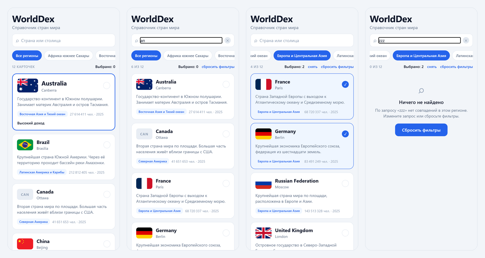

<div align="center">

**ИНСТИТУТ БИЗНЕСА И ДИЗАЙНА**

ОТЧЁТ О ПРАКТИЧЕСКОЙ РАБОТЕ / № 02

# Интерактивный UI: state, события и hooks

Разработка мобильных приложений · БИнф-24

</div>

| | | | |
| --- | --- | --- | --- |
| **АВТОР** | Телков Владимир | **ПРЕПОДАВАТЕЛЬ** | Саенко Я.Д. |
| **ДАТА** | 16.09.2026 | **ГОРОД** | Москва |

---

## 01 / ПАСПОРТ ОТЧЁТА

### Паспорт отчёта

| Поле | Значение |
| --- | --- |
| Дисциплина | Разработка мобильных приложений |
| Практическая работа | № 02 — Интерактивный UI: state, события и hooks |
| Студент | Телков Владимир Сергеевич |
| Группа | БИнф-24 |
| Преподаватель | Саенко Я.Д. |
| Дата | 16.09.2026 |
| Связанный спринт | Sprint 2 — интерактивный локальный каталог |
| Предыдущая версия продукта | Sprint 1: статическая витрина с типизированной `TopicCard` и локальными fixtures (тег `sprint-1`) |
| Ссылка на реквест с изменениями | https://github.com/Leladatan/study-mobile-project/pull/3 |
| Тег спринта | `sprint-2` |

### Цель практической работы

Добавить интерактивность в каталог, сохранив продукт, репозиторий и компоненты предыдущего
спринта.

**Продуктовый инкремент:** интерактивный локальный каталог с `FlatList`, управляемым поиском,
фильтром по региону, выбором карточек и пользовательским hook `useCatalog`.

### Задачи практической работы

**Планирование.** Взять в работу истории US-2 «Поиск страны по названию», US-6 «Фильтр по
региону» и US-11 «Выбор карточек и счётчик».

**Разработка.** Продолжить проект Sprint 1 в новой ветке, заменить ручной вывод карточек на
типизированный `FlatList`, добавить управляемое поле поиска, фильтр предметной области
со сбросом, выбор карточек со счётчиком и отложенный поиск через `useEffect`. Вынести состояние
и логику каталога в пользовательский hook.

**Проверка.** Проверить пустой результат, поиск в разных регистрах, быстрый ввод, повторный
выбор и сброс фильтра; убедиться, что возможности Sprint 1 не регрессировали.

**Review и выпуск.** Опубликовать инкремент в ветке `feature/sprint-2-interactive-catalog`,
создать pull request «Sprint 2: интерактивный локальный каталог», влить его в `main`, поставить
тег `sprint-2`, обновить README, backlog и CHANGELOG, приложить видео.

**Retrospective.** Зафиксировать ретроспективу двух спринтов: результат, затруднение,
технический долг и следующий шаг.

---

## 02 / ВЫПОЛНЕНИЕ

### Выполнение работы

#### Реализованные изменения

Витрина Sprint 1 стала интерактивным каталогом. Приложение не пересоздавалось и экран не
копировался: изменения внесены в существующие файлы, а новая логика добавлена рядом.

| Артефакт | Содержание |
| --- | --- |
| `src/hooks/useCatalog.ts` | Пользовательский hook: состояние каталога, отложенный поиск, фильтр, выбор, производный список |
| `src/components/SearchField.tsx` | Управляемое поле поиска с кнопкой очистки |
| `src/components/RegionFilter.tsx` | Лента фильтров по регионам с вариантом «Все регионы» |
| `src/components/TopicCard.tsx` | Необязательный prop `selected` и отметка выбора; контракт Sprint 1 сохранён |
| `src/screens/CatalogScreen.tsx` | `FlatList` вместо ручного перебора, счётчики, кнопки сброса, пустое состояние |
| `assets/sprint-2.webm` | Видео поиска, фильтра и выбора карточек |
| `assets/sprint-2.png` | Четыре состояния каталога на одном изображении |
| `docs/retrospective.md` | Ретроспектива спринтов |
| `README.md` | Статус, артефакты и структура проекта; описание hook и раздел «Как проверить» дописаны после слияния PR #3 |
| `docs/backlog.md` | Истории US-2, US-6 и US-11 закрыты |
| `CHANGELOG.md` | Запись `[sprint-2]` |

#### Распределение ответственности

```
useCatalog      хранит:      query, appliedQuery, regionId, selectedIds
                вычисляет:   regions, visibleTopics, selectedCount,
                             filtersActive
      |
      |  данные и обработчики
      v
CatalogScreen   отображает:  FlatList, заголовок, счётчики,
                             пустое состояние
      |
      |  props
      v
SearchField     управляемое поле поиска
RegionFilter    лента регионов
TopicCard       карточка страны
```

#### Состояние каталога

| Состояние | Тип | Назначение |
| --- | --- | --- |
| `query` | `string` | Текст в поле ввода, меняется на каждый символ |
| `appliedQuery` | `string` | Запрос, по которому фильтруется список; обновляется через 250 мс |
| `regionId` | `RegionId` или `null` | Выбранный регион; `null` — все регионы |
| `selectedIds` | `string[]` | Идентификаторы отмеченных карточек |

Список регионов, видимые карточки, число выбранных и признак активных фильтров в state
не хранятся — они вычисляются из четырёх значений выше.

#### Ключевой код

Отложенный поиск:

```ts
useEffect(() => {
  const timer = setTimeout(() => setAppliedQuery(query), SEARCH_DELAY);
  return () => clearTimeout(timer);
}, [query]);
```

Иммутабельное переключение выбора:

```ts
const toggleSelection = useCallback((topic: Topic) => {
  setSelectedIds((previous) =>
    previous.includes(topic.id)
      ? previous.filter((id) => id !== topic.id)
      : [...previous, topic.id],
  );
}, []);
```

Типизированный список:

```ts
const renderItem = useCallback<ListRenderItem<Topic>>(
  ({ item, index }) => (
    <TopicCard
      topic={item}
      onPress={toggleSelection}
      featured={index === 0 && !filtersActive}
      selected={isSelected(item)}
    />
  ),
  [toggleSelection, isSelected, filtersActive],
);

const keyExtractor = useCallback((item: Topic) => item.id, []);
```

#### Ключевые технические решения

**1. Два состояния запроса.** `query` питает поле ввода и меняется мгновенно — пользователь
видит каждый набранный символ. `appliedQuery` определяет, какие карточки показаны, и
обновляется с задержкой. Поле остаётся отзывчивым, а список не перестраивается на каждый символ.

**2. Эффект без бесконечного цикла.** `useEffect` зависит только от `query`, а меняет
`appliedQuery`. Собственную зависимость эффект не изменяет, поэтому повторного запуска
от своего же обновления не происходит. Cleanup `clearTimeout(timer)` снимает предыдущий таймер
перед каждым следующим запуском и при размонтировании: при быстром вводе срабатывает только
последний таймер.

**3. Производные данные вычисляются, а не хранятся.** `visibleTopics` получается из
`appliedQuery` и `regionId` через `useMemo`. Если бы отфильтрованный список лежал в отдельном
state, его пришлось бы синхронизировать вручную при каждом изменении запроса или фильтра,
и рано или поздно он разошёлся бы с ними.

**4. Выбор — массив идентификаторов с иммутабельным обновлением.** Отметка добавляется через
`[...previous, topic.id]`, снимается через `filter`. Проверка `includes` перед добавлением
исключает дубликаты. Используется функциональная форма `setSelectedIds((previous) => ...)`,
поэтому быстрые повторные нажатия считаются от актуального значения. Хранятся именно `id`,
а не индексы: отметка переживает смену фильтра, когда карточки меняют позиции в списке.

**5. Стабильные ключи списка.** `keyExtractor` возвращает `item.id` — код страны ISO-3.
Индекс массива как ключ не используется нигде.

**6. Содержательный фильтр с понятным сбросом.** Фильтр по региону — предметная характеристика
страны из World Bank. Сбросить его можно четырьмя способами: чипом «Все регионы», повторным
нажатием на выбранный регион, ссылкой «сбросить фильтры» над списком и кнопкой в пустом
состоянии. В ленту попадают только регионы, представленные в fixtures, — пользователь
не увидит регион, в котором нет ни одной страны.

**7. Поиск по названию и столице.** Задание требует поиск минимум по `title`. Поиск идёт
по названию и столице, оба значения и запрос приводятся к нижнему регистру.

**8. Выделенная карточка — только в полном каталоге.** Крупное оформление `featured`
получает первая карточка, но лишь пока фильтры не активны. Иначе при каждом изменении запроса
выделение перескакивало бы на случайную карточку, оказавшуюся первой.

**9. Контракт Sprint 1 сохранён.** В `TopicCardProps` добавлен только необязательный
`selected?: boolean`. `featured`, заглушка при отсутствии изображения и независимость
компонента от fixtures не изменились.

#### Проверка результата

| Проверка | Способ | Результат |
| --- | --- | --- |
| Проверка типов | `npm run typecheck` | Без ошибок |
| Конфигурация проекта | `npx expo-doctor` | 21/21 проверок пройдено |
| Чистая установка | `npm ci` в новом клоне, `tsc --noEmit` на теге `sprint-2` | Установлено 488 пакетов, `tsc --noEmit` без ошибок |
| Сборка под Android | `npx expo export --platform android` на теге `sprint-2` | Бандл собран: байт-код Hermes (`.hbc`), 1,4 МБ |
| Прямая мутация state | Поиск `push` и `splice` в `src/` | Не найдено |
| Индекс как key | Поиск `key={index` в `src/` | Не найдено |
| `any` | Поиск по `src/` | Не найдено |
| Полный каталог | Запуск | 12 карточек |
| Поиск без учёта регистра | Запрос `JAPAN` | «1 из 12» |
| Пустой запрос | Очистка поля | Все 12 карточек |
| Поиск по столице | Запрос `ottawa` | «1 из 12» — Canada |
| Фильтр | Регион «Европа и Центральная Азия» | «4 из 12» |
| Пустой результат | `japan` при фильтре по Европе | «Ничего не найдено» с объяснением |
| Сброс фильтра | Кнопка «Сбросить фильтры» | Полный каталог |
| Выбор | Нажатие на Japan, затем на Brazil | «Выбрано: 1» → «Выбрано: 2» |
| Повторный выбор | Повторное нажатие на Japan | «Выбрано: 1», дубликатов нет |
| Быстрый ввод | Посимвольный ввод с интервалом 25 мс, затем запрос `united` | Список показывает результат последнего запроса: «2 из 12» |
| Выбор при смене фильтра | Отметка карточки, затем поиск и очистка поля | Отметка сохранилась |

Сценарии проверены автоматически в браузере: скрипт вводил текст, нажимал на элементы
и ожидал появления нужного текста на экране.

#### Порядок приёмки

| Шаг приёмки | Как показать |
| --- | --- |
| Запуск и сохранность витрины Sprint 1 | `npm start` — 12 карточек, первая выделена, у Canada заглушка `CAN` |
| Поиск в разных регистрах, пустой запрос, запрос без совпадений | `JAPAN` и `japan` дают «1 из 12»; пустое поле — все карточки; `zzz` — пустое состояние |
| Фильтр и его сброс | Выбрать «Европа и Центральная Азия» — France, Germany, Russian Federation, United Kingdom; нажать «Все регионы» |
| Выбор нескольких карточек | Отметить и снять две карточки, следить за «Выбрано» |
| Код `FlatList`, управляемого `TextInput`, иммутабельного обновления | `src/screens/CatalogScreen.tsx`, `src/components/SearchField.tsx`, `toggleSelection` в `src/hooks/useCatalog.ts` |
| Зависимости `useEffect`, cleanup, структура hook | Эффект в начале `src/hooks/useCatalog.ts` и объект, который hook возвращает |
| Pull request, CHANGELOG, тег, артефакт, ретроспектива | PR #3, запись `[sprint-2]`, тег `sprint-2`, `assets/sprint-2.webm`, `docs/retrospective.md` |

---



**Рисунок 1** — Интерактивный каталог WorldDex, слева направо: полный каталог; поиск `an` —
«6 из 12»; фильтр «Европа и Центральная Азия» с двумя отмеченными карточками; пустое состояние
с кнопкой сброса. Видеозапись тех же действий — `assets/sprint-2.webm`

---

## 03 / РЕЗУЛЬТАТЫ

### Результаты работы

Получен продуктовый инкремент Sprint 2: интерактивный каталог. Пользователь вводит запрос,
выбирает регион, видит корректный список или объяснение, почему он пуст, отмечает карточки
и наблюдает счётчик. Всё работает на локальных fixtures.

Логика каталога вынесена в `useCatalog`, экран отвечает только за отображение. Возможности
Sprint 1 сохранены: карточки те же, выделение первой карточки и заглушка изображения на месте.

**Таблица 1 — Выполнение критериев приёмки**

| Критерий приёмки | Результат проверки | Статус |
| --- | --- | --- |
| FlatList получает типизированные data и renderItem, а keyExtractor возвращает стабильный id | `data: Topic[]`, `renderItem: ListRenderItem<Topic>`, `keyExtractor` возвращает `item.id` | ВЫПОЛНЕНО |
| TextInput управляется через value и onChangeText; интерфейс отражает актуальный state | `value` берётся из `query`, `onChangeText` вызывает `setQuery`; очистка и сброс меняют поле программно | ВЫПОЛНЕНО |
| Поиск не зависит от регистра, пустой запрос возвращает полный каталог | `JAPAN` и `japan` дают одинаковый результат; пустое поле — 12 карточек | ВЫПОЛНЕНО |
| Фильтр влияет на результат и может быть сброшен; пустой результат объяснён пользователю | Фильтр по региону, четыре способа сброса, пустое состояние с причиной и кнопкой | ВЫПОЛНЕНО |
| Выбор карточки обновляется иммутабельно, дубликаты исключены, счётчик соответствует состоянию | Новый массив при каждом изменении, проверка `includes`, счётчик равен длине `selectedIds` | ВЫПОЛНЕНО |
| Hooks вызываются на верхнем уровне React-компонента или пользовательского hook | Все вызовы — в теле `useCatalog` и `CatalogScreen` до разметки, без условий и ранних `return` | ВЫПОЛНЕНО |
| useEffect имеет полный список зависимостей и cleanup; быстрый ввод не оставляет лишние таймеры | Зависимость `[query]`, cleanup `clearTimeout`; проверено посимвольным вводом | ВЫПОЛНЕНО |
| Пользовательский hook отделяет логику каталога от отображения, а Sprint 1 не регрессировал | Экран не импортирует fixtures; контракт `TopicCard` расширен только необязательным prop | ВЫПОЛНЕНО |

**Таблица 2 — Соблюдение ограничений**

| Ограничение | Статус |
| --- | --- |
| Не мутировать state напрямую: `push`, `splice`, присваивание полям | Соблюдено — только новые массивы и функциональные обновления |
| Не использовать индекс массива как key для элементов со стабильным id | Соблюдено — ключ `item.id` |
| Не вызывать hooks внутри условий, циклов, callback или после условного `return` | Соблюдено |
| Не создавать effect, который изменяет собственную зависимость | Соблюдено — эффект зависит от `query`, меняет `appliedQuery` |
| Не подключать API, Redux, базу данных и навигацию раньше соответствующих спринтов | Соблюдено |

**Таблица 3 — Definition of Done спринта**

| Пункт | Статус |
| --- | --- |
| Поиск, фильтр, выбор и пустое состояние работают на целевой платформе | Проверено в веб-сборке и сборкой Android-бандла; запуск на устройстве через Expo Go демонстрируется на защите |
| TypeScript-проверка, lint и доступные проверки качества проходят без ошибок | ЧАСТИЧНО — `tsc --noEmit` без ошибок, `expo-doctor` 21/21; линтер ESLint в проекте не настроен |
| Код не содержит прямой мутации state и нарушений Rules of Hooks | ВЫПОЛНЕНО |
| Изменения прошли через pull request и объединены в основную ветку | ВЫПОЛНЕНО — PR #3 влит в `main` |
| README и CHANGELOG описывают интерактивный каталог и способ проверки | ВЫПОЛНЕНО — запись `[sprint-2]` в CHANGELOG; описание каталога и раздел «Как проверить» в README исправлены после слияния PR #3, см. проблему 6 |
| Создан тег `sprint-2` и приложен демонстрационный артефакт | ВЫПОЛНЕНО — тег на коммите `2a96afd`, видео и изображение в `assets/` |
| В ретроспективе зафиксированы результат, затруднение, технический долг и следующий шаг | ВЫПОЛНЕНО — `docs/retrospective.md` |

**Таблица 4 — Публикация**

| Поле | Значение |
| --- | --- |
| Ветка | `feature/sprint-2-interactive-catalog` |
| Pull request | #3 «Sprint 2: интерактивный локальный каталог», влит 09.09.2026 |
| Тег | `sprint-2` → коммит `2a96afd` |
| CHANGELOG | FlatList, поиск, фильтр, выбор карточек и `useCatalog` |
| Артефакт | `assets/sprint-2.webm` — видео поиска, фильтра и выбора; `assets/sprint-2.png` |

### Анализ результата

Цель работы — добавить интерактивность, сохранив продукт и компоненты предыдущего спринта —
достигнута. Все восемь критериев приёмки закрыты, все пять ограничений соблюдены. Из семи пунктов
Definition of Done один закрыт частично: проверки типов и конфигурации проходят, но линтер
в проекте не настроен.

Главный показатель качества спринта — насколько мало пришлось менять код Sprint 1. Компонент
`TopicCard` получил один необязательный prop, существующие вызовы остались корректными.
Это подтверждает, что разделение «экран владеет данными, карточка отображает» было выбрано
правильно ещё в прошлом спринте.

Отдельно стоит отметить состав state. В hook хранятся только четыре исходных значения, всё
остальное вычисляется из них. Такое решение исключает целый класс ошибок, когда отфильтрованный
список, счётчик или признак активного фильтра расходятся с тем, что выбрал пользователь.

Проверка выполнена не вручную, а сценарием, который вводил текст и нажимал на элементы
в запущенном приложении. Одиннадцать сценариев, включая быстрый ввод, повторный выбор и
сохранение отметок при смене фильтра, прошли без ошибок.

### Возникшие проблемы и решения

**Проблема 1. Список перестраивался бы на каждый набранный символ.**

Если фильтровать каталог по тому же значению, которое хранит поле ввода, при наборе слова
`japan` список пересчитывается пять раз и на экране мелькают промежуточные результаты.

**Решение:** состояние запроса разделено на `query` для поля и `appliedQuery` для фильтрации.
`appliedQuery` обновляется через 250 мс после последнего изменения — `useEffect` с cleanup,
который отменяет предыдущий таймер.

**Проблема 2. Риск бесконечного цикла в эффекте.**

Типичная ошибка отложенного поиска — эффект, который зависит от значения и сам же его меняет:
каждое обновление снова запускает эффект.

**Решение:** зависимость и изменяемое значение разнесены. Эффект читает `query` и пишет
`appliedQuery`, а в списке зависимостей только `query`.

**Проблема 3. Выделенная карточка перескакивала бы при фильтрации.**

В Sprint 1 первой карточке всегда передавался `featured`. После появления поиска первой
в списке может оказаться любая страна, и крупное оформление прыгало бы от карточки к карточке
при каждом изменении запроса.

**Решение:** `featured={index === 0 && !filtersActive}` — выделение действует только в полном
каталоге.

**Проблема 4. Тег поставлен до обновления локальной ветки.**

Pull request был влит на GitHub, но локальная ветка `main` не была обновлена командой
`git pull`. Тег `sprint-2` встал на коммит Sprint 1 `88d9e63`, и теги `sprint-1` и `sprint-2`
указали на одно и то же состояние — в теге `sprint-2` не оказалось `useCatalog`.

**Решение:** выполнен `git pull`, тег перенесён на коммит слияния командами
`git tag -f -a sprint-2` и `git push origin sprint-2 --force`. Для проверки перед постановкой
тега достаточно `git log --oneline -1`: верхний коммит должен быть слиянием pull request.

**Проблема 5. OneDrive блокирует каталоги при переключении веток.**

Как и в Sprint 1, при переключении веток git не мог удалить каталоги, удерживаемые
синхронизацией OneDrive.

**Решение:** на время операций с ветками синхронизация приостанавливается.

**Проблема 6. Описание каталога в README не обновилось.**

Правка README выполнялась заменой абзаца по точному тексту. Текст в файле отличался на два
слова, совпадение не нашлось, и замена молча не произошла. В результате в слитом PR #3 статус,
артефакты и структура проекта в README были обновлены, а раздел «Как устроена витрина» по-прежнему
описывал поведение Sprint 1, и раздела «Как проверить» не было. Ошибка обнаружена при подготовке
отчёта, когда разделы README сверялись с Definition of Done.

**Решение:** описание `FlatList` и `useCatalog` и раздел «Как проверить» добавлены в README
отдельным коммитом после слияния. Вывод: при автоматической правке документов проверять, что
каждая замена действительно применилась, а не полагаться на сообщение об успешном завершении.

### Ретроспектива

**Что получилось.** Логика каталога целиком в одном hook, экран остался простым, хотя
функциональность выросла в несколько раз. Состояние минимально, производные данные вычисляются.
Контракт `TopicCard` выдержал расширение без переделки.

**Что мешало.** Отложенный поиск требует аккуратности: без cleanup остаются лишние таймеры,
с неправильными зависимостями появляется цикл. При публикации повторилась ошибка с тегом —
на этот раз из-за пропущенного `git pull`. Часть правок README не применилась и была замечена
только при подготовке отчёта.

**Технический долг.** Линтер не настроен, соблюдение Rules of Hooks проверяется вручную,
а не автоматически. Отмеченные карточки хранятся в памяти и теряются при перезапуске.
Поиск приводит строки к нижнему регистру через `toLowerCase` — для латиницы этого достаточно,
для языков со сложными правилами регистра нет.

**Следующий шаг.** Подключить ESLint с правилами для hooks. В Sprint 3 перейти с fixtures
на World Bank Indicators API: загрузка списка по сети, состояния загрузки и ошибки. Источник
данных сменится внутри `useCatalog`, разметка экрана при этом меняться не должна.

#### Ретроспектива двух спринтов

| | Sprint 1 | Sprint 2 |
| --- | --- | --- |
| Результат | Статическая витрина, контракт `TopicCard`, модель `Topic` | Поиск, фильтр, выбор, `FlatList`, `useCatalog` |
| Затруднение | Backlog противоречил методическим указаниям | Корректный отложенный поиск без лишних таймеров и цикла |
| Технический долг | Данные в коде, `ScrollView` монтирует всё сразу | Нет линтера, выбор не сохраняется между запусками |
| Процесс | Тег поставлен до создания pull request | Тег поставлен до `git pull` |
| Следующий шаг | Перейти на `FlatList` — закрыто в Sprint 2 | ESLint и подключение API в Sprint 3 |

Общий вывод по двум спринтам: архитектурные решения Sprint 1 окупились сразу — Sprint 2 почти
не потребовал правок существующих компонентов. Слабым местом оба раза оказалась публикация,
причём ошибка одна и та же по сути: тег ставился на состояние, которое ещё не содержало работу
спринта. Правило на будущее — перед тегом проверять, что верхний коммит `main` является слиянием
pull request текущего спринта.

---

## 04 / ЗАВЕРШЕНИЕ

### Выводы

**Основной результат.** Статическая витрина превращена в интерактивный каталог. Реализованы
типизированный `FlatList` со стабильными ключами, управляемое поле поиска без учёта регистра,
фильтр по региону со сбросом, выбор карточек со счётчиком и пустое состояние с объяснением.
Состояние и логика вынесены в пользовательский hook `useCatalog`.

**Соответствие цели и критериям приёмки.** Цель достигнута. Все восемь критериев приёмки
закрыты, все пять ограничений соблюдены: state не мутируется, индексы как ключи не используются,
hooks вызываются на верхнем уровне, эффект не изменяет собственную зависимость, API, Redux,
база данных и навигация не подключены. Возможности Sprint 1 сохранены. Единственный частично
закрытый пункт Definition of Done — отсутствие настроенного линтера — вынесен в технический долг.

**Закреплённые навыки и инженерные подходы.** Различие между state и производными данными.
Иммутабельное обновление массивов и функциональная форма обновления state. Корректная работа
с `useEffect`: полный список зависимостей и cleanup для внешних ресурсов. Правила вызова hooks
и причина, по которой они существуют. Вынесение логики в пользовательский hook, чтобы экран
отвечал только за отображение.

---

## 05 / КОНТРОЛЬНЫЕ ВОПРОСЫ

### Контрольный вопрос 1

**Чем state отличается от обычной локальной переменной компонента?**

**ОТВЕТ.** Локальная переменная создаётся заново при каждом вызове функции-компонента, то есть
при каждой перерисовке, и её изменение не приводит к обновлению экрана. State хранит React
между перерисовками, а изменение через setter планирует новую перерисовку с новым значением.

Если бы запрос в каталоге хранился в `let query = ''`, набранный текст терялся бы при первой же
перерисовке, а список не реагировал бы на ввод. Поэтому в `useCatalog` четыре значения хранятся
в state. При этом отфильтрованный список намеренно не является state: он вычисляется из запроса
и региона, и хранить его отдельно значило бы рисковать рассинхронизацией.

### Контрольный вопрос 2

**Почему TextInput называется управляемым компонентом?**

**ОТВЕТ.** Потому что значением поля управляет React state, а не само поле. `SearchField`
получает `value` из `query` и на каждое изменение вызывает `onChangeText`, который обновляет
state. Источник истины — state, поле лишь отображает его.

Практическое следствие — приложение может менять содержимое поля само. Кнопка очистки вызывает
`onChange('')`, а «Сбросить фильтры» в `useCatalog` выполняет `setQuery('')`, и поле пустеет.
В неуправляемом поле текст хранился бы внутри компонента, и сброс фильтров его бы не очистил.

### Контрольный вопрос 3

**Зачем FlatList нужен стабильный keyExtractor?**

**ОТВЕТ.** По ключу React сопоставляет элементы списка между перерисовками: какой элемент
остался, какой исчез, какой появился. Если ключом служит индекс, после фильтрации карточка Japan
на позиции 0 получит ключ, который раньше принадлежал Australia, и React переиспользует чужой
элемент. Возникают лишние перемонтирования и путаница в визуальном состоянии строк.

В каталоге `keyExtractor` возвращает `item.id` — код страны ISO-3. Он не меняется при фильтрации,
поэтому каждая карточка сохраняет свою идентичность, а отметка выбора, которая тоже хранится
по `id`, всегда относится к правильной стране.

### Контрольный вопрос 4

**Почему props и state рассматриваются как неизменяемые снимки?**

**ОТВЕТ.** Каждая перерисовка получает свой снимок props и state, и обработчики, созданные
в этой перерисовке, видят именно его. Решение, нужно ли обновлять экран, React принимает,
сравнивая ссылки. Если выполнить `selectedIds.push(id)` и передать тот же массив в setter,
ссылка не изменится, React может пропустить обновление, и счётчик не обновится. Заодно будет
испорчен снимок, на который опираются уже вычисленные значения.

Поэтому выбор обновляется созданием нового массива: `[...previous, topic.id]` при добавлении
и `previous.filter(...)` при удалении. Функциональная форма `setSelectedIds((previous) => ...)`
гарантирует, что при быстрых нажатиях каждое обновление считается от актуального значения.

### Контрольный вопрос 5

**Какие два ограничения определяют допустимое место вызова hooks?**

**ОТВЕТ.** Первое: hooks вызываются только на верхнем уровне — не внутри условий, циклов,
вложенных функций и callback, не после условного `return`. Второе: hooks вызываются только
из React-компонентов-функций или из пользовательских hooks, но не из обычных функций.

Причина в том, что React связывает состояние с порядком вызова hooks. Если в одной перерисовке
`useState` вызовется, а в следующей будет пропущен из-за условия, все последующие значения
сдвинутся и перепутаются. В проекте `useCatalog` вызывает четыре `useState`, `useEffect`, два
`useMemo` и четыре `useCallback` безусловно в начале функции; `CatalogScreen` вызывает
`useCatalog` и два `useCallback` до разметки, ранних `return` в нём нет.

### Контрольный вопрос 6

**Когда нужен useEffect и зачем ему cleanup?**

**ОТВЕТ.** `useEffect` нужен для синхронизации с тем, что находится вне перерисовки React:
таймерами, подписками, сетевыми запросами, API устройства. Для вычисления данных из state
эффект не нужен — это делается прямо при перерисовке или через `useMemo`.

В каталоге эффект управляет таймером отложенного поиска. Зависимость `[query]` перезапускает
эффект при каждом изменении запроса. Cleanup `clearTimeout(timer)` выполняется перед следующим
запуском и при размонтировании. Без него при вводе `japan` осталось бы пять таймеров, каждый
применил бы свой промежуточный запрос, а после ухода с экрана таймер пытался бы обновить
несуществующий компонент.

### Контрольный вопрос 7

**Как пользовательский hook отделяет логику от отображения?**

**ОТВЕТ.** `useCatalog` содержит всё, что относится к поведению каталога: state, эффект
отложенного поиска, правила фильтрации и выбора. Наружу он возвращает обычный объект с данными
и обработчиками — `query`, `setQuery`, `visibleTopics`, `selectedCount`, `toggleSelection`,
`resetFilters` и другие.

`CatalogScreen` не импортирует fixtures и не знает, как устроена фильтрация: он связывает
полученные значения с компонентами. Отсюда выгоды: экран читается как описание интерфейса,
логику можно использовать на другом экране, а при переходе на API источник данных сменится
внутри hook без изменения разметки. Пользовательский hook разделяет логику, а не состояние:
каждый вызов `useCatalog` создаёт своё независимое состояние.

### Источники

1. Meta Platforms. *FlatList — React Native.* https://reactnative.dev/docs/flatlist
   (дата обращения: 16.09.2026).
2. Meta Platforms. *TextInput — React Native.* https://reactnative.dev/docs/textinput
   (дата обращения: 16.09.2026).
3. React. *useState.* https://react.dev/reference/react/useState (дата обращения: 16.09.2026).
4. React. *useEffect.* https://react.dev/reference/react/useEffect (дата обращения: 16.09.2026).
5. React. *Rules of Hooks.* https://react.dev/reference/rules/rules-of-hooks
   (дата обращения: 16.09.2026).
6. React. *State as a Snapshot.* https://react.dev/learn/state-as-a-snapshot
   (дата обращения: 16.09.2026).
7. React. *Updating Arrays in State.* https://react.dev/learn/updating-arrays-in-state
   (дата обращения: 16.09.2026).
8. React. *Reusing Logic with Custom Hooks.* https://react.dev/learn/reusing-logic-with-custom-hooks
   (дата обращения: 16.09.2026).

---

<div align="center">

Институт бизнеса и дизайна · obe.ru · Москва · 2026

</div>
